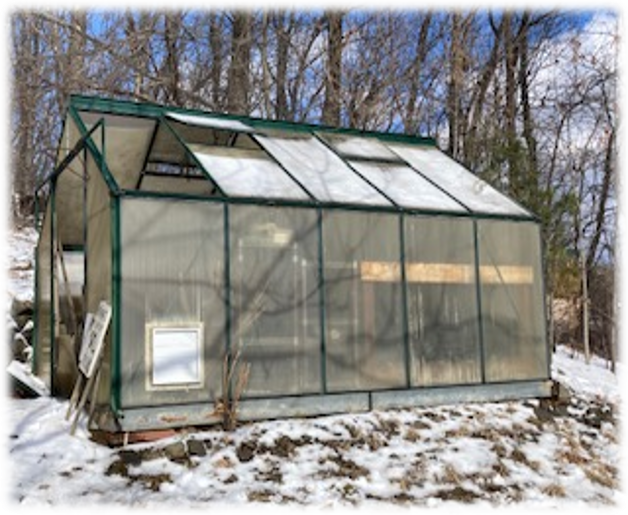
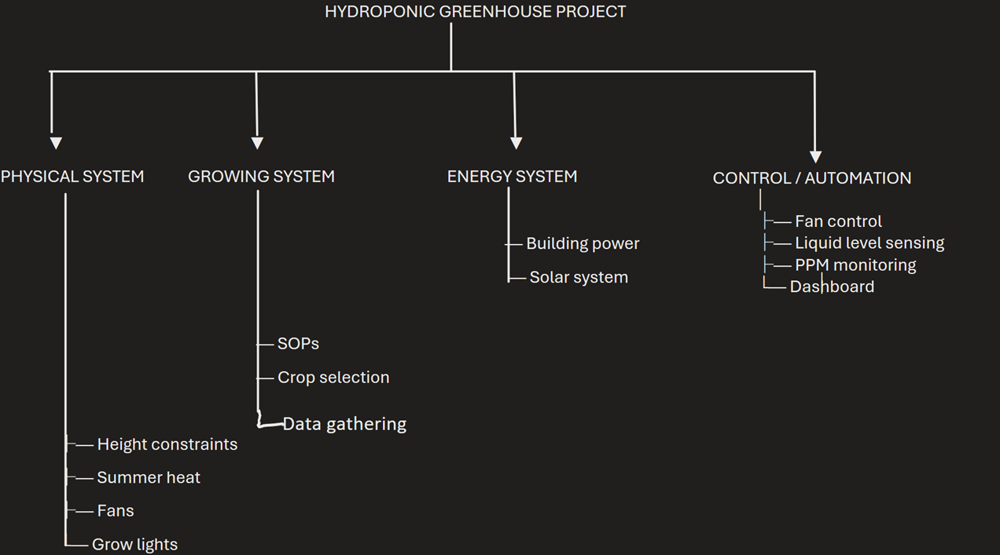
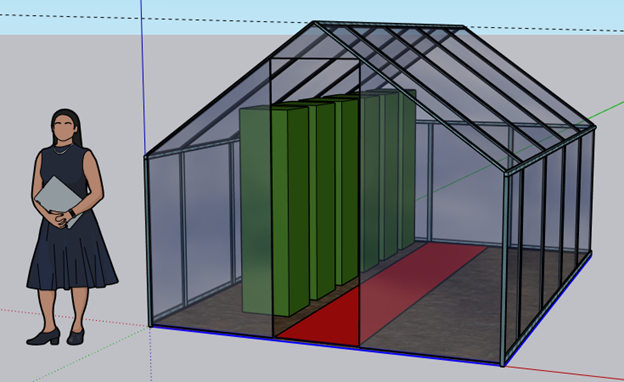

# HCC Greenhouse Hydroponic Project
Designing an automated hydroponic growing system for educational research and food production.

## Overview
This project focuses on designing and building a modular hydroponic growing system inside an existing greenhouse.

The goal is to combine environmental science, engineering, biology, and data science to create a sustainable food-growing system while providing hands-on learning opportunities for students.

Areas of focus include:

- Hydroponic tower design
- Greenhouse Climate Control
- Energy efficiency
- Solar power integration
- Environmental monitoring
- Automation
- Data collection and analysis

### Project Map

This project focuses on designing and building a modular hydroponic growing system inside an existing greenhouse.

The goal is to combine environmental science, engineering, biology, and data science to create a sustainable food-growing system while providing hands-on learning opportunities for students.
Areas of focus include:

- Hydroponic tower design
- Greenhouse climate control
- Energy efficiency
- Solar power integration
- Environmental monitoring
- Automation
- Data collection and analysis

## Project Goals
1. Produce vegetables using hydroponic towers
2. Build a data-driven growing system
3. Develop automation for greenhouse management
4. Explore solar-powered operation
5. Provide interdisciplinary learning opportunities for students

## Greenhouse Layout

Approximate working area: 
The hydroponic system will occupy approximately half the greenhouse initially.
The entire floor space of the greenhouse is: **12 ft x 8.5 ft**

Structure:
- Metal frame greenhouse
- Plexiglass panels
- Slanted roof (4 ft to 7 ft height)
- No built-in flooring

## System Components
Hydroponic Growing Systems
- Vertical tower systems
- Nutrient reservoirs
- Water circulation pumps
- Nutrient monitoring

Climate Control
	- Ventilation fans
- Temperature monitoring
- Humidity monitoring
- Summer heat management

Lighting
	- DC powered grow lights
- Comparison of DC vs AC efficiency
- Possible solar-powered lighting system

Automation
Potential automated systems:
- Fan control
- Water level monitoring
- Nutrient concentration (ppm)
- Temperature monitoring
- Lighting schedules

Data Collection
Sensors will collect:
- Temperature
- Humidity
- Nutrient concentration
- Water levels
- Light intensity

## Technology Stack
###Software:
- Python
- Streamlit dashboards
- GitHub version control

###Hardware:
- ESP8266 / microcontrollers
- Environmental sensors
- Pumps and relays

###Design:
- SketchUp
- CAD modeling

## Project Roadmap
Phase 1 — Physical Setup
•	Build hydroponic tower layout
•	Install power lines
•	Set up water reservoirs
________________________________________
Phase 2 — Monitoring
•	Install sensors
•	Collect environmental data
•	Create dashboards
________________________________________
Phase 3 — Automation
•	Automated fan control
•	Water level monitoring
•	Nutrient monitoring
________________________________________
Phase 4 — Energy System
•	Solar panel integration
•	Battery storage
•	DC lighting system
________________________________________

## Student Participation
This project is open to students interested in:

- Environmental Science
- Engineering
- Biology
- Agriculture
- Data science
- Renewable energy
- Automation

## Possible student projects:
•	Sensor development
•	Automation systems
•	Data visualization
•	Plant growth experiments
•	Solar power design

## Repository Structure
/greenhouse_design
    CAD drawings and layout models

/hydroponic_system
    tower designs and plumbing plans

/automation
    microcontroller code

/data_dashboard
    Streamlit dashboards

/docs
    documentation and diagrams

## Future Vision
The long-term goal is to create a scalable greenhouse system that combines:
- Hydroponic agriculture
- Environmental monitoring
- Automation
- Renewable energy

The project will serve as both a research platform and a teaching tool for interdisciplinary STEM education.
