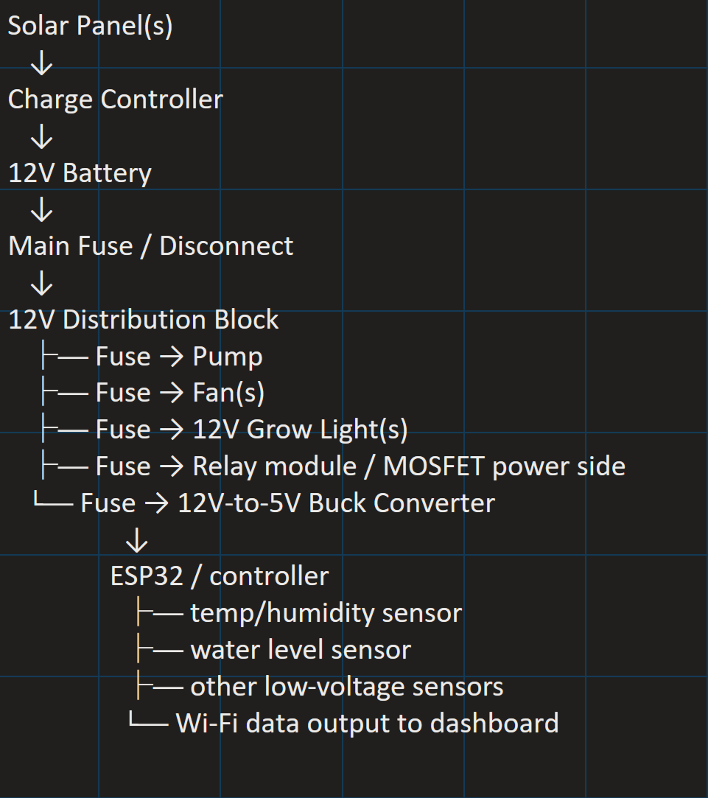

# Changelog

All notable changes to the Hydroponic Greenhouse Project.
# Changelog

## [0.6] - 2026-5-17
### Added
- Streamlit code
  - added to app.py
- Added files to the following folders:
  - `Data/`
    - greenhouse_readings.csv
  - `Pages/`
    - environmental_analysis.py
    - historical_trends.py
    - tower_comparison.py
  - `Utils/`
    - calculations.py
    - data_loader.py

### Configured
- venv – activating
- initial running of the streamlit app.py – no errors
- Git repository commit
- Github push

## [0.5] - 2026-05-16

### Added
- Initial Streamlit dashboard structure
- Created `app.py` main dashboard entry point
- Added multi-page dashboard architecture
- Added folders for:
  - `pages/`
  - `data/`
  - `utils/`
- Added placeholder analysis pages:
  - `tower_comparison.py`
  - `environmental_analysis.py`
  - `historical_trends.py`

### Configured
- Python virtual environment setup
- Streamlit dependency management via `requirements.txt`
- Git repository initialization

### Notes
- Dashboard prepared for future DHT22 sensor integration
- CSV-based environmental logging pipeline planned
- Initial greenhouse monitoring architecture established
---
## [v0.4] - 2026-04-10
### Added
- Solar Power System Overview
- Solar power system overview schematinc has been created to determine the exact componenets necessary for purchase. 

## [v0.3] - 2026-03-28
### Added
- Initial Streamlit dashboard concept for monitoring system data
- 1st Hydroponic tower was received. It was tested for modularity - successful. It was fitted to the greenhouse.

### In Progress
- Access to power has become more amplified.  We have found that access to AC power is at best, short-term. 

---

## [v0.2] - 2026-03-20
### Added
- Greenhouse layout planning (tower placement)
- Identified summer heat issue → need for fans
- Ordered 2 × 100 ft power cords from nearby building

### Notes
- Considering DC vs AC grow lights (leaning DC for efficiency)

---

## [v0.1] - 2026-03-10
### Added
- Project concept initiated
- Defined goals: hydroponics + automation + data collection
- Initial outreach ideas (culinary dept, community gardens)