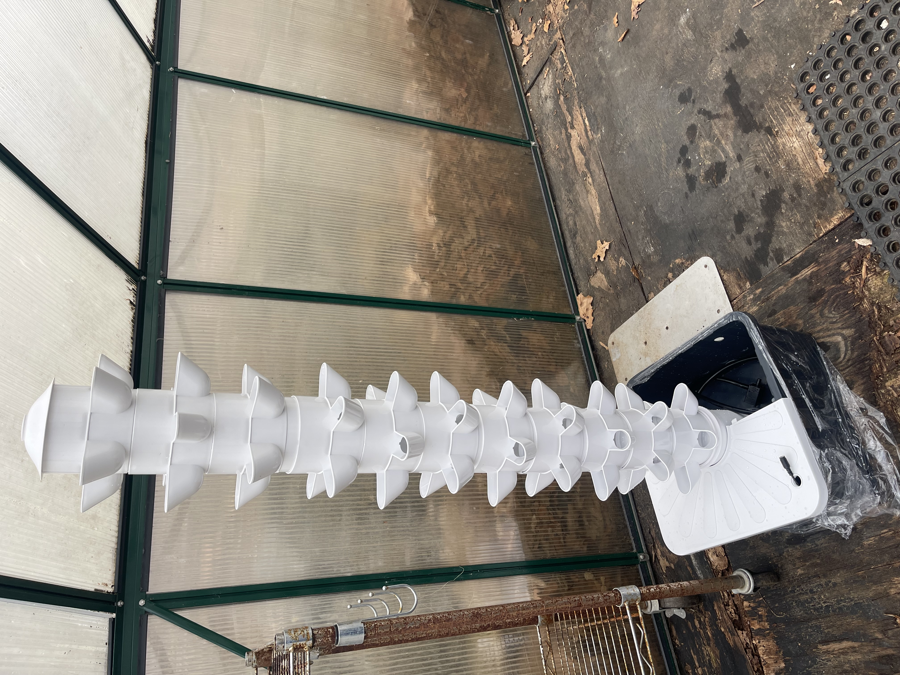

# Changelog

All notable changes to the Hydroponic Greenhouse Project.

---

## [v0.3] - 2026-03-28
### Added
- Initial Streamlit dashboard concept for monitoring system data
- 1st Hydroponic tower was received. It was tested for modularity - successful. It was fitted to the greenhouse.

### In Progress
- Access to power has become more amplified.  We have found that access to AC power is at best, short-term. 

---

## [v0.2] - 2026-03-20
### Added
- Greenhouse layout planning (tower placement)
- Identified summer heat issue → need for fans
- Ordered 2 × 100 ft power cords from nearby building

### Notes
- Considering DC vs AC grow lights (leaning DC for efficiency)

---

## [v0.1] - 2026-03-10
### Added
- Project concept initiated
- Defined goals: hydroponics + automation + data collection
- Initial outreach ideas (culinary dept, community gardens)